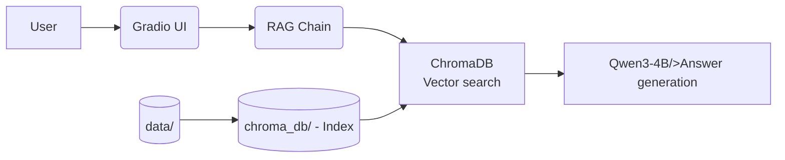

# Legal RAG Assistant

[English](README.md) | [Русский](README_RU.md)

## Overview

This project implements a domain-specific legal assistant focused exclusively on Russian federal legislation. 
It leverages Retrieval-Augmented Generation (RAG) to ground LLM responses in authoritative legal sources

Unlike generic chatbots, this system:

- Prevents hallucinations by retrieving real legal articles before generating answers.
- Cites sources (e.g., “Article 236 of the Labor Code of the Russian Federation”).

Built for lawyers, compliance officers, HR professionals, and citizens seeking reliable legal guidance within the Russian jurisdiction.

## Key Features

- Source-grounded answers via RAG over a structured legal corpus.
- Qwen3-4B backbone: Efficient 4B-parameter open-source LLM with strong Russian language support.
- Semantic search: ChromaDB-powered vector retrieval with embeddings from intfloat/multilingual-e5-large.
- Citation-aware responses: Every answer references relevant legal articles.
  
## Architecture

## Data & Compliance
- The knowledge base is built from publicly available Russian legal sources.
- No personal or case-specific data is stored or processed by default.
- Designed to comply with Russian data localization laws.
