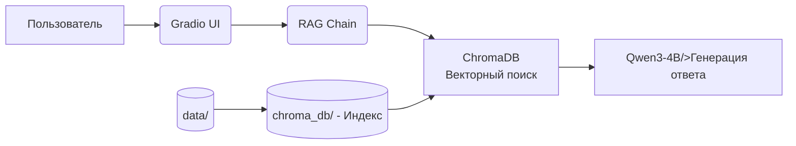

# Legal RAG Assistant

[English](README.md) | [Русский](README_RU.md)

## Обзор

Проект представляет собой реализацию domain-specific юридического помощника, ориентированного на российское федеральное законодательство. 
Он использует технологию RAG в качестве основы для ответов LLM на основе авторитетных юридических источников.

В отличие от стандартных чат-ботов, эта система:

- Предотвращает галлюцинации, извлекая реальные юридические статьи перед генерацией ответов.
- Ссылается на источники (например, «Статья 236 Трудового кодекса Российской Федерации»).

Проект предназначен для юристов, специалистов по комплаенсу, специалистов по кадрам и граждан, ищущих юридическую помощь в российской юрисдикции.

## Ключевые особенности

- Ответы основанны на источниках, через RAG на основе юридического корпуса.
- Qwen3-4B backbone: Эффективная open-source LLM с хорошей поддержкой русского языка.
- Семантический поиск: Векторный поиск на базе ChromaDB на основе эмбеддингов, полученных с помощью модели intfloat/multilingual-e5-large.
- Ответы с цитированием: Каждый ответ содержит ссылки на соответствующие юридические статьи.

## Архитектура

## Данные и требования
- База знаний формируется на основе общедоступных российских юридических источников.
- Никакие персональные или связанные с конкретными случаями данные по умолчанию не хранятся и не обрабатываются.
- Разработанно с учётом локализации данных на русском языке и форматировании с учётом требований российского законодательства.
